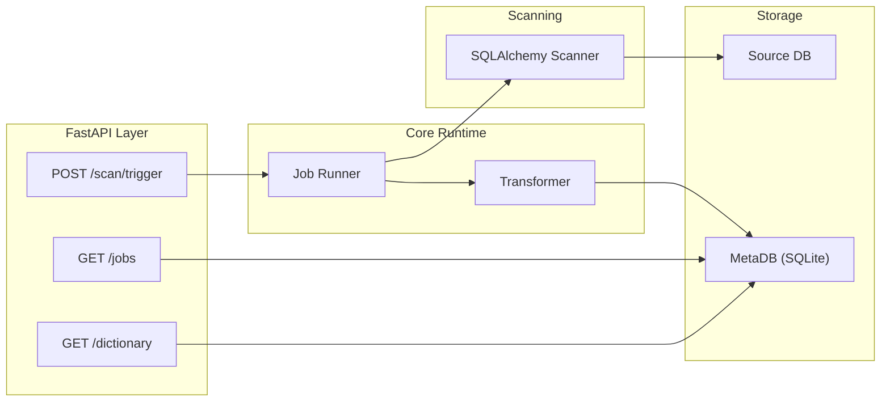

# Metadata Governance Toolkit

A production-minded metadata governance service built in Python to scan database schemas, normalize metadata into a standardized data dictionary, and persist it reliably using idempotent, hash-driven ingestion patterns.

This project reflects how I design and reason about metadata systems after working extensively with enterprise data platforms—where correctness, repeatability, and operational resilience are non-negotiable.

The goal is not to demonstrate a framework, but to model how a **real metadata ingestion service behaves in production** when run repeatedly, monitored, and trusted by downstream consumers.

---

## Why This Exists

In most data platforms, metadata is treated as a by-product rather than a first-class asset.  
That leads to duplication, drift, inconsistent catalogs, and brittle governance workflows.

This toolkit is built on the belief that:
- Metadata ingestion must be **deterministic**
- Re-runs should be **safe and idempotent**
- Failures should be **observable and debuggable**
- Local development should be **frictionless**, with a clear path to scale

Everything in this repository follows those principles.

---

## Design Philosophy

Every design decision mirrors patterns I use in production systems:

- **Idempotent ingestion** using stable hash keys to prevent duplication
- **Clear separation of concerns** between scanning, transformation, and persistence
- **Explicit job lifecycle tracking** for observability and failure analysis
- **Operational hygiene** through logging, disk monitoring, and cleanup routines
- **Local-first defaults** with environment-driven configuration for real databases

This is intentionally opinionated. The goal is correctness and reliability over convenience.

---

## What This Project Demonstrates

- Production-grade Python system design beyond scripts and notebooks
- Hands-on experience with metadata ingestion and governance workflows
- Safe, repeatable persistence using hash-based upsert strategies
- API-driven orchestration with clear execution semantics
- Operational awareness (logging, monitoring, cleanup, failure visibility)
- Extensible architecture suitable for real enterprise integrations

---

## Architecture

### High-level Flow (Mermaid)

> GitHub renders Mermaid diagrams automatically in `README.md`.


### Component View (Mermaid)



---

## Quickstart (Local)

The project defaults to a **local SQLite setup** for zero-friction onboarding.  
No external database is required to run or evaluate the system.

### Prerequisites
- Python 3.12+

### Setup

```bash
git clone <your-repo-url>
cd metadata-governance-toolkit

python -m venv .venv
source .venv/bin/activate

pip install .
mkdir -p .metadb
```

### Start the API

```bash
python -m uvicorn mgt.api.app:app --reload
```

Open Swagger UI:
- http://127.0.0.1:8000/docs

---

## API Walkthrough

### Health Check
```bash
curl http://127.0.0.1:8000/health
```

### Trigger a Metadata Scan
```bash
curl -X POST http://127.0.0.1:8000/scan/trigger
```

This scans the source database schema and persists results into MetaDB using idempotent logic.

### View Job History
```bash
curl "http://127.0.0.1:8000/jobs?limit=10"
```

Returns execution status, timestamps, and error details (if any).

### Query the Data Dictionary
```bash
curl "http://127.0.0.1:8000/dictionary?limit=20"
```

Returns normalized metadata records (one row per column per object).  
Re-running scans will **update existing entries**, not duplicate them.

---

## Screenshots (Recruiter-friendly)

Create this folder and add PNGs:
- `docs/images/`

Recommended files:
- `docs/images/swagger-ui.png`
- `docs/images/trigger-scan.png`
- `docs/images/jobs.png`
- `docs/images/dictionary.png`

Once you commit those files, they will render here:

**Swagger UI**


**Trigger Scan**


**Jobs**


**Data Dictionary**


---

## Docker

```bash
docker build -t metadata-governance-toolkit .
docker run -p 8000:8000 metadata-governance-toolkit
```

---

## Configuration

All configuration is environment-driven.

Example (`.env.example`):

```env
META_DB_URL=sqlite:///./.metadb/metadb.sqlite
SOURCE_DB_URL=sqlite:///./.metadb/source_demo.sqlite
LOG_LEVEL=INFO
```

The local SQLite setup is intended for development.  
The same code path supports Postgres or other relational databases via SQLAlchemy.

---

## CI & Quality

This repository includes:
- Automated test execution via GitHub Actions
- Clean packaging using a src-layout
- Explicit dependency management

The intent is to keep the project runnable, verifiable, and reviewable at any point in time.

---

## Notes

- Runtime data (`.metadb/`, logs, SQLite files) is intentionally excluded from version control
- The demo database is auto-created locally to keep onboarding simple
- The architecture is designed to extend naturally toward:
  - async job execution
  - metadata export connectors (Collibra/DataHub/Atlas)
  - lineage and catalog integrations

---

## Closing Thought

This project is less about “how to use FastAPI” and more about **how metadata systems should be built**: deterministic, observable, and safe to run every day.

That mindset is what I bring to real production data platforms.
